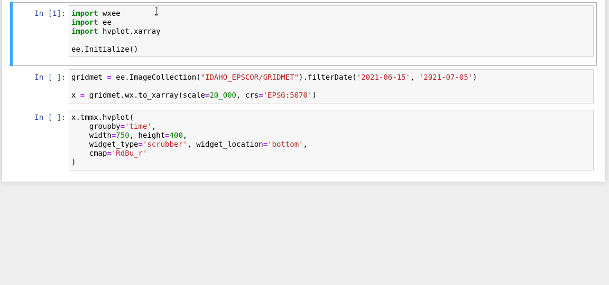

# eexarray
[](https://eexarray.readthedocs.io/en/latest/?badge=latest)
[](https://github.com/psf/black)
[](https://www.gnu.org/licenses/gpl-3.0)

A Python interface between Earth Engine and xarray



## What is eexarray?
eexarray was designed to make processing gridded, mesoscale time series data quick and easy by providing a bridge between the data catalog and processing power of Google Earth Engine and the flexibility of xarray and numpy, with no complicated setup required. To accomplish this, eexarray implements convenient methods for data processing and conversion.

### Features
- Time series image collections to xarray and NetCDF in one line of code
- Temporal resampling in EE (hourly to daily, daily to monthly, etc.)
- Images and image collections to GeoTIFF
- Parallel processing for fast downloads
- Support for masked nodata values

## What *isn't* eexarray?
eexarray isn't built to export huge amounts of data. The "no setup required" approach means it has strict download size limits imposed by Earth Engine's URL downloading system. If you run into download issues, try using a larger scale or splitting images into smaller regions. If you are regularly downloading large amounts of high resolution data, consider using Earth Engine's built-in Drive exporting or a tool like [restee](https://github.com/KMarkert/restee).

eexarray also isn't a weather/climate processing toolkit. There are great Python packages out there already like [MetPy](https://github.com/Unidata/MetPy) and [ACT](https://github.com/ARM-DOE/ACT), so why reinvent the wheel? eexarray focuses on taking care of the heavy lifting so you can work with your data in domain-specific tools. 

## Installation

Pip and Conda coming soon...

### From source
```bash
git clone https://github.com/aazuspan/eexarray
cd eexarray
make install
```

## Quickstart

Check out the [full documentation](https://eexarray.readthedocs.io/en/latest/) here.


### Using the eex Accessor

eexarray uses the `eex` accessor to extend Earth Engine classes. Just import eexarray and use `.eex` to access eexarray methods.

```python
import ee, eexarray
ee.Initialize()

ee.Image( ... ).eex
ee.ImageCollection( ... ).eex
```

### Converting an Image Collection to xarray

```python
import ee, eexarray
ee.Initialize()

imgs = ee.ImageCollection("NOAA/NWS/RTMA").filterDate("2020-09-08", "2020-09-15")
arr = imgs.eex.to_xarray(scale=40_000, crs="EPSG:5070")
```

### Temporal Resampling
```python
import ee, eexarray
ee.Initialize()

hourly = ee.ImageCollection("NOAA/NWS/RTMA").filterDate("2020-09-08", "2020-09-15")
daily_max = hourly.eex.resample_daily(reducer=ee.Reducer.max())
```

### Downloading Images to GeoTIFF
```python
import ee, eexarray
ee.Initialize()

img = ee.Image("COPERNICUS/S2_SR/20200803T181931_20200803T182946_T11SPA")
img.eex.to_tif(out_dir="data", scale=200, crs="EPSG:5070")
```

### Known Bugs
Downloading imagery from Earth Engine can fail due to communication issues with Google's servers. eexarray will automatically retry failed downloads, but if downloads continue to fail you can try 1) setting the `max_attempts` argument to a higher value or 2) waiting a few minutes and re-running your download.

## Contributing
Bugs or feature requests are always appreciated! They can be submitted [here](https://github.com/aazuspan/eexarray/issues). 

Code contributions are also welcome! Please open an [issue](https://github.com/aazuspan/eexarray/issues) to discuss implementation, then follow the steps below.

### Developer Setup
1. Create a fork of eexarray.

2. Download and install the package and developer dependencies from your fork.
```bash
git clone https://github.com/{username}/eexarray
cd eexarray
make install-dev
```

3. Create a new feature branch.
```bash
git checkout -b {feature-name}
```

4. Write features and tests and commit them (all pre-commit checks must pass). Add NumPy-style docstrings and type hints for any new functions, methods, or classes.

```bash
git add {modified file(s)}
git commit -m "{commit message}"
```

5. Rebuild documentation when docstrings are added or changed.
```bash
make docs
make view-docs
```
